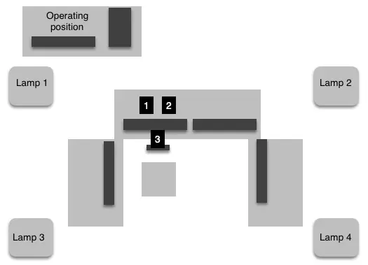

Welcome to the **Driver Fatigue Detection Benchmark** repository. This resource is dedicated to advancing the development and testing of driver safety technologies through a comprehensive collection of multimodal data. Utilizing thermal imaging, depth mapping, and visible light cameras, the dataset is uniquely prepared under varied environmental conditions to simulate real-world driving scenarios.

## Data Collection Setup

Data was collected in a controlled environment designed to mimic the driver's seat of a vehicle, featuring:
- **Three distinct camera types**: visible light, thermal, and depth map cameras.
- **Simulated driving environment**: Equipped with five monitors to display various driving scenarios.
- **Multi-spectral data capture**: Simultaneous recording from all three camera types to capture a wide range of data points.

import { Tabs, TabItem } from '@astrojs/starlight/components';

<Tabs>
  <TabItem label="Schema">
    
  </TabItem>
  <TabItem label="Photos">
    
    
  </TabItem>
</Tabs>

## Data Characteristics

The dataset includes:
- **44 subjects** from diverse demographics, including different genders, ages, and varying physical features such as glasses and beards.
- **Multi-spectral recordings**: Each subject was recorded simultaneously by all three cameras, providing a comprehensive set of data across different imaging modalities.
- **Varied data scenarios**: Subjects performed a series of predefined actions to simulate different levels of driver fatigue.
  - **Yawning without Covering Mouth**: Videos capturing subjects yawning openly, which is a common sign of tiredness.
  - **Yawning with Mouth Covered**: This class includes videos where subjects cover their mouths while yawning, often considered a social behavior to mask tiredness.
  - **Eye Rubbing**: Subjects are shown rubbing their eyes, a behavior typically associated with fatigue and eye strain.
  - **Head Dropping**: This category features subjects whose heads drop in a nodding motion, indicating severe drowsiness or loss of alertness.
  - **Frequent Blinking**: Recordings of subjects blinking more frequently than usual, which can indicate the early stages of fatigue.

Each class is designed to represent specific fatigue-related behaviors. The variety in recorded actions allows researchers to train more robust models that can detect a wide range of fatigue signs under various conditions.


## Scenario Description

Participants were asked to engage in a sequence of actions mimicking driver fatigue, which includes:
1. **Basic Driving Simulation**: Engaging in normal driving activities with occasional blinking.
2. **Induced Fatigue Symptoms**: Performing actions such as frequent eye blinks, eye rubbing, yawning, and head movements.
3. **Transition to Severe Fatigue**: Simulating severe fatigue symptoms like yawning with hand gestures and aggressive head shaking.

These structured scenarios ensure the dataset captures both subtle and pronounced signs of driver fatigue.


## Access and Use

We encourage researchers and developers to utilize this dataset for academic, research, and development purposes. Please cite the original work appropriately when using this dataset in your research or publications.

### Citation Requirement

When using this dataset, reference the following citation:

```bibtex
@article{Malecki2020_benchmark,
  author    = {Ma{\l}ecki, Krzysztof and Forczma{\'{n}}ski, Pawe{\l} and Nowosielski, Adam and Smoli{\'{n}}ski, Anton and Ozga, Daniel},
  title     = {A New Benchmark Collection for Driver Fatigue Research Based on Thermal, Depth Map and Visible Light Imagery},
  booktitle = {Progress in Computer Recognition Systems},
  year      = {2020},
  publisher = {Springer International Publishing},
  pages     = {295--304},
  doi       = {10.1007/978-3-030-19738-4_30},
  isbn      = {978-3-030-19738-4}
}
```

import { Aside } from '@astrojs/starlight/components';

<Aside title="Link to Article">
  [Read the full article on ResearchGate](https://www.researchgate.net/publication/332948824_A_New_Benchmark_Collection_for_Driver_Fatigue_Research_Based_on_Thermal_Depth_Map_and_Visible_Light_Imagery)
</Aside>

---
