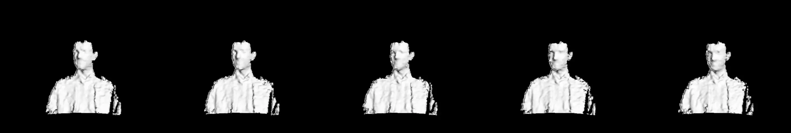

import { Aside } from '@astrojs/starlight/components';
import { Tabs, TabItem } from '@astrojs/starlight/components';
import { Steps } from '@astrojs/starlight/components';

Welcome to our detailed explanation of the preprocessing steps performed on the Driver Fatigue Detection dataset. This dataset was meticulously processed to enhance the effectiveness of machine learning models aimed at detecting signs of driver fatigue.

Before utilizing the data for machine learning and analysis, it is crucial to perform thorough preprocessing to ensure data quality and reliability. The following sections describe the detailed steps we took to preprocess the data collected using various sensors.

## Frame Synchronization and Alignment

Due to the manual operation of cameras during the data collection phase, slight desynchronizations occurred between recordings from different modalities. This issue was particularly challenging as the RGB camera (`normal`) operated at a different frame rate compared to other sensors, potentially leading to inconsistencies in event timing across the dataset.

To address these issues, we standardized the frame rate across all recordings to ensure uniformity. Specifically, all videos were adjusted to the same frames per second (FPS).

Furthermore, we meticulously reviewed the timestamps of recorded events and adjusted the start times of the videos where necessary. This manual alignment was crucial to ensure that similar events across different modalities started at approximately the same frame, allowing for more accurate comparative analysis and feature extraction.

<Aside>
    Despite these efforts, it's important to note that minor misalignments might still exist due to the manual nature of the synchronization process.
</Aside>

## Region of Interest (ROI) Extraction and Resolution Scaling

Initially, heatmaps were created for each video file to visualize areas of most frequent movement by the recorded subjects. These heatmaps were crucial in pinpointing the exact regions within the video where significant activity occurred, which are critical for detecting fatigue-related behaviors.

<Steps>
1. **Create Heatmaps**: For each modality (RGB1, RGB2, depth, and thermal), heatmaps were generated to identify the most active areas.
2. **Compare Heatmaps**: Heatmaps from each modality were compared to align the areas of interest across all data streams.
3. **Define ROI**: The regions with the most activity were marked as the Region of Interest (ROI) for each clip.
4. **Uniform Aspect Ratio**: We adjusted the aspect ratio of all clips to be uniform, ensuring that each video segment maintained consistent dimensions across different viewing platforms.
5. **Crop Video**: Using the defined ROI, unnecessary areas outside this region were removed from each clip to ensure focus on relevant data.
</Steps>

After cropping the videos to the appropriate ROI, all clips were resized to a uniform resolution. This step is essential to ensure that the subjects' dimensions are consistent across all clips and modalities, which is vital for accurate automated analysis and machine learning classification.

## Event Tagging and Video Cutting

During the preprocessing phase, continuous video recordings were segmented into smaller clips that focus on specific, fatigue-related events. This segmentation is essential for isolating behaviors directly linked to driver fatigue, enabling more precise analysis and facilitating effective training of machine learning models.

The following events, indicative of fatigue, were manually tagged on the RGB (`normal`) video footage based on visible symptoms. These tags help in precisely isolating fatigue-related behaviors:

- **Yawning without Covering Mouth**: Captured when participants yawn openly without using hands to cover their mouths.
- **Yawning with Mouth Covered**: Tagged when participants cover their mouths during yawning, often seen as an attempt to hide fatigue.
- **Eye Rubbing**: This behavior signifies tiredness and is tagged when participants frequently rub their eyes.
- **Head Dropping**: Indicates sleepiness or loss of alertness and is captured when there is a sudden or gradual drop of the head.
- **Long Blink Duration**: This involves tagging extended eye closures, significantly longer than a typical blink, indicating increased drowsiness.

Each event was manually tagged by reviewing the RGB video recordings. Operators marked the start and end frames for each event, capturing the precise moments when fatigue-related behaviors occurred. These timestamps were then used to cut the continuous footage into smaller clips, ensuring that each clip contained just one specific event.

Using the frame numbers from the manual tagging process, segments corresponding to each event were extracted from all modalities (RGB1, RGB2, depth, and thermal cameras). This method ensured that each small video clip across all data streams started and ended at the same time, providing a synchronized view of the event across different sensor data.

<Tabs>
  <TabItem label="Yawning without Covering Mouth">
    
    
    
    
  </TabItem>
  <TabItem label="Yawning with Mouth Covered">
    
    
    
    
  </TabItem>
  <TabItem label="Eye Rubbing">  
    
    
    
    
  </TabItem>
  <TabItem label="Head Dropping">  
    
    
    
    
  </TabItem>
  <TabItem label="Unnatural Blinking">
    
    
    
    
  </TabItem>
</Tabs>

---
